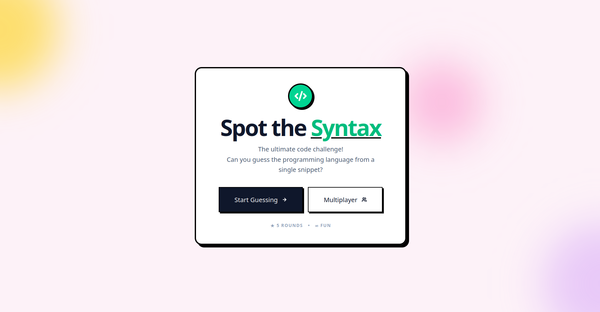

# Spot The Code

[](https://spot-the-code.lavizpandey.com.np/)



A free, programming-style Geoguessr clone. Test your knowledge by guessing the origin, language, or context of various code snippets. 

This project was built using [Better-T-Stack](https://github.com/AmanVarshney01/create-better-t-stack), a modern TypeScript stack that integrates React, TanStack Start, and other modern web tooling.

## Tech Stack

* **TypeScript** - Type safety and tooling
* **TanStack Start** - SSR framework with TanStack Router
* **TailwindCSS** - Utility-first styling
* **shadcn/ui** - Accessible, reusable UI components
* **Bun** - Fast JavaScript runtime and package manager

## Project Structure

This project uses a monorepo setup:

```text
spot-the-code/
├── apps/
│   └── web/         # Fullstack application (React + TanStack Start)
├── packages/
│   ├── api/         # API layer / business logic
└── bun.lock
```
# Local Development
## Prerequisites

    Bun installed on your machine.

## Setup

    Clone the repository:
    Bash

    git clone https://github.com/lavizp/spot-the-code.git
    cd spot-the-code

    Install dependencies:
    Bash

    bun install

    Start the development server:
    Bash

    bun run dev

The application will be available at http://localhost:3001.

